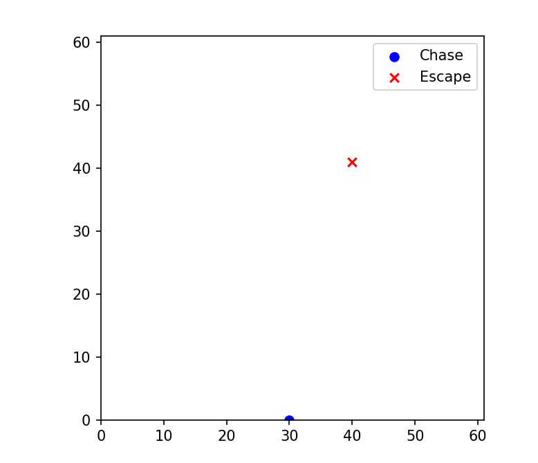

# baseline使用demo

## 1.使用train
直接使用learn就可以进行进行训练，进行一些简单的配置

## 2.使用log记录

```python
#模型保存路径
log_dir = "./dqn_MyEnv2_tensorboard/"

new_logger = configure(log_dir, ["stdout", "tensorboard"])

model.set_logger(new_logger)
# Define the evaluation and checkpoint callbacks
eval_callback = EvalCallback(env, best_model_save_path=log_dir,
                             log_path=log_dir, eval_freq=500,
                             deterministic=True, render=False)

checkpoint_callback = CheckpointCallback(save_freq=1000, save_path=log_dir,
                                         name_prefix='dqn_model')
```

## 3.自己写的一个env进行测试

环境是一个简单的追击问题，如果A追击到B就算任务完成，场景图片如下：



## 4.自己的环境使用render进行可视化展示


``` python 
  def render(self):
        if not hasattr(self, 'fig'):
            self.fig, self.ax = plt.subplots()
            self.ax.set_xlim(0, self.grid_size)
            self.ax.set_ylim(0, self.grid_size)
            self.ax.set_aspect('equal', adjustable='box')
            self.chase_pos = self.ax.scatter([], [], marker='o', color='blue', label='Chase')
            self.escape_pos = self.ax.scatter([], [], marker='x', color='red', label='Escape')
            self.ax.legend()
            self.fig.show()

        self.chase_pos.set_offsets([[self.chase[0].item(), self.chase[1].item()]])
        self.escape_pos.set_offsets([[self.escape[0].item(), self.escape[1].item()]])
        self.fig.canvas.draw()
        print(self.chase)
        print(self.escape)

        self.fig.canvas.flush_events()
```
这个部分简单使用matplotlib制作了一个场景进行展示，如果只是简单的展示一张图片不是一个类似于视频效果的时候，可以使用下面的代码


```python
    def render(self):
        fig, ax = plt.subplots()
        ax.set_xlim(0, self.grid_size)
        ax.set_ylim(0, self.grid_size)
        ax.set_aspect('equal', adjustable='box')

        chase_pos = ax.scatter([], [], marker='o', color='blue', label='Chase')
        escape_pos = ax.scatter([], [], marker='x', color='red', label='Escape')
        ax.legend()

        def init():
            chase_pos.set_offsets([[float('nan'), float('nan')]])  # Empty initialization
            escape_pos.set_offsets([[float('nan'), float('nan')]])  # Empty initialization
            return chase_pos, escape_pos,

        def update(frame):
            chase_pos.set_offsets([self.chase[0].item(), self.chase[1].item()])
            escape_pos.set_offsets([self.escape[0].item(), self.escape[1].item()])
            return chase_pos, escape_pos,

        ani = animation.FuncAnimation(fig, update, frames=10, repeat=False, blit=True)
        plt.show(block=False)
        plt.pause(0.5)
        plt.close(fig)
```